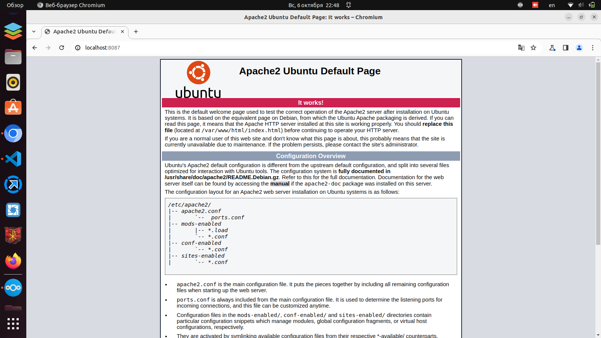

# Домашнее задание: Настройка ПК

Настроить рабочее место

## Решение:
Для выполнения задания была использована методичка.
- Был установлен Vagrant из зеркала Яндекса (https://hashicorp-releases.yandexcloud.net/vagrant/)
- Был создан Vagrantfile, где использовался образ из репозитория elab.pro (ENV['VAGRANT_SERVER_URL'] = 'https://vagrant.elab.pro')


<details><summary>Содержимое Vagrantfile:</summary>

```
# -*- mode: ruby -*-
# vim: set ft=ruby :

ENV["LC_ALL"] = "en_US.UTF-8"
ENV['VAGRANT_SERVER_URL'] = 'https://vagrant.elab.pro'


Vagrant.configure("2") do |config|
  #Указываем, какую ОС мы будем использовать
  config.vm.box = "ubuntu/focal64"
  #Можно указать конкретную версию сборки 
  #Номера сборок можно посмотреть в Vagrant Cloud
#  config.vm.box_version = "1.0.0"

  #Проброс порта с гостевой машины в хост
  #Порт 80 в созданной ВМ будет доступен нам на порту 8080 хоста
  config.vm.network "forwarded_port", guest: 80, host: 8087
  config.vm.network "private_network", ip: "192.168.56.11", virtualbox__intnet: true

  #Указываем настройки спецификации ВМ
  #Указывается в отдельном цикле
  config.vm.provider "virtualbox" do |vb|
     # Указываем количество ОЗУ и ядер процессора
     vb.memory = "2048"
     vb.cpus = "1"
  end
  
  #Первоначальная настройка созданной ВМ
  #Установка и запуск Веб-сервера Apache2
  config.vm.provision "shell", inline: <<-SHELL
     mkdir -p ~root/.ssh
     cp ~vagrant/.ssh/auth* ~root/.ssh
     sudo apt-get update
     sudo apt-get install -y apache2
  SHELL
end

```
</details>

Результат на скриншоте:


При этом на основном рабочем месте с ОС АЛЬТ, где после очередного обновления оказались:
- vagrant версии 2.4.1
- VirtualBox версии 7.0.18

Эти версии оказались неработоспособны, а именно виртуальная машина средствами virtualbox запускается нормально, но при выполнении `vagrant up` в выводе имеем:

```
Stderr: VBoxManage: error: The virtual machine 'OTUS-Task1v2_default_1728238123730_9955' has terminated unexpectedly during startup with exit code 1 (0x1)
VBoxManage: error: Details: code NS_ERROR_FAILURE (0x80004005), component MachineWrap, interface IMachine
```
Придётся возвращать версии vagrant 2.2.19 и Virtualbox 6.1. И модуль ядра тоже.